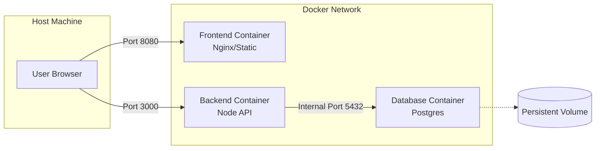

# Why use docker compose

It becomes cumbersome to manage a multicontainer application when using only docker 

## Docker compose basics

### Co to projekt

Projekt to logiczna grupa kontenerów, sieci i wolumenów zdefiniowana w jednym pliku `docker-compose.yml`

Domyślnie docker bierze nazwę katalogu w którym znajduje się `docker-compose.yml` i dodaje ten prefiks do każdego z uruchamianych kontenerów (pozwala to na re-używanie takich rzeczy jak db, backend, frontend itp..).

### Networking 

Już rozumiemy w jaki sposób kontenery zapewniają izolację. Projekty łączą wiele kontenerów oraz łączą je za pomocą odizolowanych sieci w taki sposób, że kontenery w jednej sieci zawsze widzą siebie nawzajem, lecz kontenery innych projektów nie muszą.

#### Subnet 

Projekty używające sieci tworzą wirtualną sieć `subnet`, która jest całkowicie odcięta od sieci hosta. Wewnątrz tej sieci kontenery mogą rozmawiać ze sobą za pomocą wszystkich portów, lecz zewnętrzna komunikacja jest dozwolono tylko przez porty zmapowane w `docker-compose.yml`:
```
ports:
  - 8080:80 # mapowanie wewnętrznego portu 80 na zewnętrzny port 8080
```
Jest to możliwe dzięki tworzonemu mostkowi `Docker Bridge`, który działa jak switch, który łączy wszystkie zawarte kontenery oraz pozwala na łączenie sieci hosta z projektem. 

#### Service Discovery

Dodatkowo sieć projektu jest automatycznie wyposażana w serwer DNS, który pozwala odwoływać się do kontenerów za pomocą ich nazwy zamiast addresów IP.

#### Wyjątek

Da się również tworzyć projekt, który nie używa tego mechanizmu izolacji `network-mode: host`.
Kontenery tworzone w tym trybie "pożyczają" kartę sieciową maszyny hosta. Używane na przykład w projektach o wysokiej wydajności lub VPN.

### Wolumeny

Kontenery oraz projekty są z natury `ulotne`. To znaczy, że przy ich usunięciu wszystkie zawarte w nich dane są usuwane. Zapisywanie danych w systemie plików kontenera nie jest dobrą opcją.

Docker umożliwia prace na stałych danych poprzez zarządzanie plikami na maszynie hosta.

`Volumes` to nazwane "sejfy" zarządzane przez dockera, które są zapisywane na zarezerwowanym izolowanym obszarze na maszynie hosta: `/var/lib/docker/volumes/<volume_name>`. Projekty zawierające wolumeny mogą być wyłączane bez utraty informacji co jest przydatne np..: w bazach danych. 

`Mount:binds` to mechanizm, który pozwala kontenerom mapować zewnętrzny system plików hosta do swojego wewnętrznego. Może być to przydatne np..: hot-reload aplikacji podczas developmentu, odczytywanie aktualnego stanu maszyny hosta.


## ChatStack (example app)



### presentation

1. why use compose (comparison between docker cli and docker compose)
2. syntax relation between docker and compose 
3. portainer visualization
4. showcase networking dns. Get into a container and ping services 
5. showcase volume persistance (kill all except volume and run again without replacing volume)